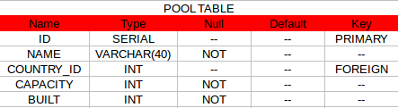
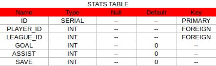

Parts Implemented by Caghan Caglar
==================================
Tables
------
Pool Table consists of 5 attributes.

   Pool Table

- **ID**        : New ID values for each Pool tuple

- **NAME**       : Name of the Pool (Stadium)

- **COUNTRY_ID** : Foreign key that references the COUNTRY_ID attribute of the Country Table with "ON DELETE CASCADE ON UPDATE CASCADE" option for Data Integrity

- **CAPACITY**   : Number of seats that Pool (Stadium) has

- **BUILT**      : Built year of the Pool (Stadium)

**Sql statement that initialize the Pool table:**

.. code-block:: python

   DROP TABLE IF EXISTS POOL;
   CREATE TABLE POOL(NAME VARCHAR(40) NOT NULL, COUNTRY_ID INT,
                      CAPACITY INT NOT NULL, BUILT INT NOT NULL,
                      ID SERIAL PRIMARY KEY);
   ALTER TABLE POOL ADD CONSTRAINT FK_POOL_COUNTRIES FOREIGN KEY (COUNTRY_ID)
               REFERENCES COUNTRIES (ID) ON DELETE CASCADE ON UPDATE CASCADE;

----------------------------------------------------------------------------

Stats Table consists of 6 attributes.

   Stats Table

- **ID**        : New ID values for each Statistic tuple

- **PLAYER_ID** : Foreign key that references the PLAYER_ID attribute of the Player Table with "ON DELETE CASCADE ON UPDATE CASCADE" option for Data Integrity

- **LEAGUE_ID** : Foreign key that references the LEAGUE_ID attribute of the League Table with "ON DELETE CASCADE ON UPDATE CASCADE" option for Data Integrity

- **GOAL**      : Number of goals that Player scored

- **ASSIST**    : Number of assists that Player made

- **SAVE**      : Number of saves that Player made

**Sql statement that initialize the Stats table:**

.. code-block:: python

   DROP TABLE IF EXISTS STATS;
   CREATE TABLE STATS(PLAYER_ID INT,LEAGUE_ID INT, GOAL INT DEFAULT 0,
                            ASSIST INT DEFAULT 0,SAVE INT DEFAULT 0,
                            ID SERIAL PRIMARY KEY);
   ALTER TABLE STATS ADD CONSTRAINT FK_STATS_PLAYERS FOREIGN KEY (PLAYER_ID)
               REFERENCES PLAYERS (ID) ON DELETE CASCADE ON UPDATE CASCADE;
   ALTER TABLE STATS ADD CONSTRAINT FK_STATS_LEAGUES FOREIGN KEY (LEAGUE_ID)
               REFERENCES LEAGUES (ID) ON DELETE CASCADE ON UPDATE CASCADE;

Table Operations
----------------
Pool Page
~~~~~~~~~
Table Operations
----------------
There are 2 'Post' method possibilities for Pool page. Since this page initially lists the pools, update and delete options are available at the beginning. These options are coded in the pools.html file with values 'deletePoolbyid' and 'updatePoolbyid'. If one of these values are sended in the form necessary sql querry is done properly. If these values are not in form value then it is obvious that 'Get' method is used, so all datas of the pools in database is fetched and sended to the pools.html file for listing operation.
This kind of implementation of 'Get' method prevents the failures for the case of Update and Delete button clicks without any radio option selected.

.. code-block:: python

   @app.route('/Pools', methods=['GET', 'POST'])
   def pool_list():
       if 'deletePoolbyid' in request.form:
           try:
               connection = psycopg2.connect(app.config['dsn'])
               cursor=connection.cursor()
               poolid = request.form['deletePoolbyid']
               query = """delete from pool where id=""" + poolid + """;"""
               cursor.execute(query)
               connection.commit()
               connection.close()
               return redirect('/Pools')
           except :
               return redirect('/Pools')
       elif 'updatePoolbyid' in request.form:
           try:
               connection = psycopg2.connect(app.config['dsn'])
               cursor=connection.cursor()
               poolid = request.form['updatePoolbyid']
               query = """select pool.name, countries.name, pool.capacity, pool.built,
                  pool.id from pool join countries on pool.country_id=countries.id
                  where pool.id=""" + poolid + """;"""
               cursor.execute(query)
               poolupdated = list(cursor.fetchall()[0])
               query = """ SELECT ID,NAME FROM COUNTRIES ORDER BY NAME;"""
               cursor.execute(query)
               countryfetch = cursor.fetchall()
               connection.close()
               countryListForm = []
               for country in countryfetch:
                   countryListForm.append(list(country))
               now = datetime.datetime.now()
               return render_template('pool_update.html', current_time=now.ctime(),
                  element=poolupdated,countryList=countryListForm)
           except :
               return redirect('/Pools')
       else:
           try:
               connection = psycopg2.connect(app.config['dsn'])
               cursor=connection.cursor()
               query = """select pool.name, countries.name, pool.capacity, pool.built,
                  pool.id from pool join countries on pool.country_id=countries.id;"""
               cursor.execute(query)
               poolfetch = cursor.fetchall()
               connection.close()
               PoolListForm = []
               for pool in poolfetch:
                   PoolListForm.append(list(pool))
               now = datetime.datetime.now()
               return render_template('pools.html', current_time=now.ctime(), list=PoolListForm)
           except :
               return redirect('/Pools')

Search option in Pool page is implemented by making a query by taking keyword value within the search textbox as name attribute of the Pools. In order to prevent whole database listing of search with empty keyword is prevented by the control of the length of the keyword. After a succesful query, Pool page is rendered with the name constrainted datas in the database.

.. code-block:: python

   @app.route('/SearchPool' , methods=['POST'])
   def pool_search():
       try:
           connection = psycopg2.connect(app.config['dsn'])
           cursor=connection.cursor()
           PoolListForm = []
           now = datetime.datetime.now()
           name = request.form['searchbyname']
           if len(name)==0:
               return render_template('pools.html', current_time=now.ctime(), list=PoolListForm)
           query = """select pool.name, countries.name, pool.capacity, pool.built, pool.id from pool join countries on pool.country_id=countries.id where (pool.name like '%""" + name + """%');"""
           cursor.execute(query)
           poolfetch = cursor.fetchall()
           connection.close()
           for pool in poolfetch:
               PoolListForm.append(list(pool))
           return render_template('pools.html', current_time=now.ctime(), list=PoolListForm)
       except :
           return redirect('/Pools')

At Add Pool page, country list is fetched from database and provided to user as selection option. After the input entering process of user is finished posted form values in html file are assigned to variables and proper sql query is made with these variables. Since try-catch blocks are used wrong queries are prevented and page is redirected if necessary.

.. code-block:: python

   @app.route('/AddPool', methods=['GET', 'POST'])
   def pool_edit():
           if request.method == 'GET':
               try:
                   connection = psycopg2.connect(app.config['dsn'])
                   cursor=connection.cursor()
                   query = """ SELECT ID,NAME FROM COUNTRIES ORDER BY NAME;"""
                   cursor.execute(query)
                   countryfetch = cursor.fetchall()
                   connection.close()
                   countryListForm = []
                   for country in countryfetch:
                       countryListForm.append(list(country))
                   now = datetime.datetime.now()
                   return render_template('pool_edit.html', current_time=now.ctime(),countryList=countryListForm)
               except :
                   return redirect('/Pools')
           else:
               try:
                   connection = psycopg2.connect(app.config['dsn'])
                   cursor=connection.cursor()
                   name = request.form['name']
                   countryid = request.form['countryid']
                   capacity = request.form['capacity']
                   built = request.form['built']
                   query = """insert into pool values('""" + name + """',""" + countryid + """,""" + capacity + """,""" + built + """);"""
                   cursor.execute(query)
                   connection.commit()
                   connection.close()
                   return redirect('/Pools')
               except:
                   return redirect('/Pools')

At Update Pool page, html design is in same form as Pool Adding page except this page takes the attribute values of the tuple that will be updated and fills the necessary parts automatically for making this page easy o use for user. When the form data is posted to this function, it makes an update query with the provided form data.

.. code-block:: python

   @app.route('/UpdatePool', methods=['POST'])
   def pool_update():
       try:
           connection = psycopg2.connect(app.config['dsn'])
           cursor=connection.cursor()
           name = request.form['name']
           countryid = request.form['countryid']
           capacity = request.form['capacity']
           built = request.form['built']
           poolid=request.form['poolid']
           query = """update pool set name='""" + name + """',country_id=""" + countryid + """,capacity=""" + capacity + """,built=""" + built + """ where id=""" + poolid + """;"""
           cursor.execute(query)
           connection.commit()
           connection.close()
           return redirect('/Pools')
       except:
           return redirect('/Pools')