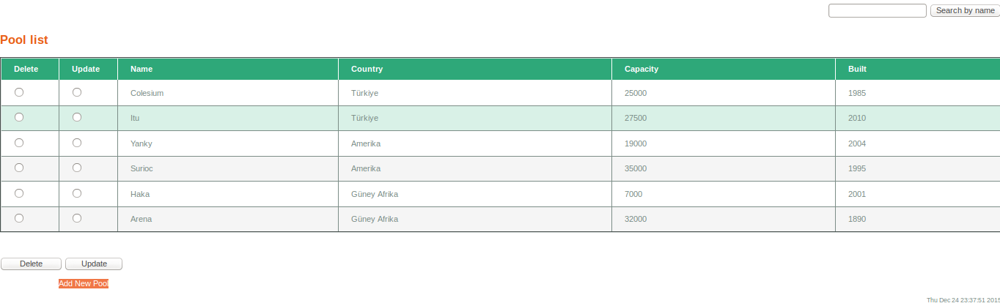

Pool Page
=========
This page automaticaly lists the entire pools in database with their related information which are name of the pool, in which country it is located, its capacity and its built date.
Radio buttons are placed for each entry in the list for deleting and updating the selected entry. For searching a specific pool from database there is a textbox at the top-right side of the page. New pool data can be add from the 'Add New Pool' link at the bottom of the page.

   Pool Page

.. toctree::
   Pooldetails

