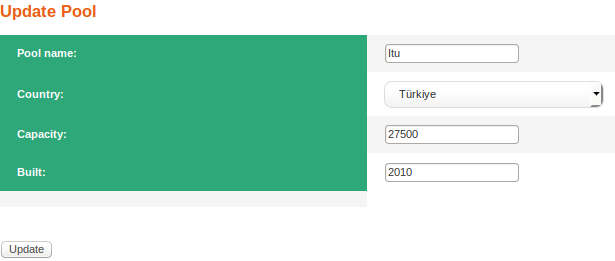

Search Operation
================
Keyword for the name of the pool which could be partial or full name should be placed to the top-right textbox and 'search by name' button should be clicked.
After this operation all pools whose name include the keyword that user wrote to textbox will be displayed.

   Result after the search with keyword 'Itu'

Add Operation
=============
After selecting 'Add New Pool' from the Pool page user will be directed to new page which includes textboxes for the name,capacity and built date information about the new pool data and a selection part for the country where new pool is located. After input entering process is done and 'Add' button is clicked user will be redirected to the Pool page which will list the pools with the new entry.

   Pool Adding Page

Delete Operation
================
User can select the pool entry that wanted to be deleted from its radio button, after the 'Delete' button is clicked selected entry will be deleted form the database and user will be directed to the Pool page with updated pool list.

Update Operation
================
User can select the pool entry that wanted to be updated from its radio button, after the 'Update' button is clicked user will be directed to the pool updating page. This page has similar structure with Pool Adding page however all entries are filled with the information of the selected pool for easy use. After input entering process is done and 'Updated' button is clicked user will be redirected to the Pool page with updated pool list.

   Pool Updating Page

