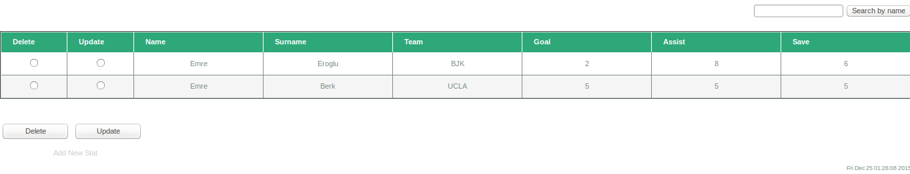
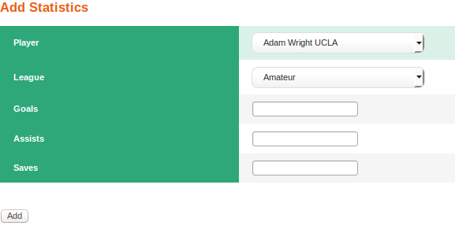
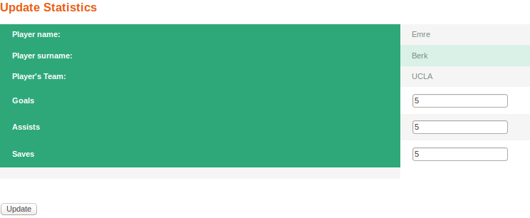

Search Operation
================
Keyword for the name of the player which could be partial or full name should be placed to the top-right textbox and 'search by name' button should be clicked.
After this operation all players whose name include the keyword that user wrote to textbox will be displayed with their statistics.

   Result after the search with keyword 'Emre'

Add Operation
=============
After selecting 'Add New Stat' from the Statistics Page user will be directed to new page which includes textboxes for the goal, assist and save numbers and a selection part for the name and team of the player and in which league his team belongs. After input entering process is done and 'Add' button is clicked user will be redirected to the Statistics Page.

   Statistic Adding Page

Delete Operation
================
User can select the player statistic entry that wanted to be deleted from its radio button, after the 'Delete' button is clicked selected entry will be deleted form the database and user will be directed to the Statistics page.

Update Operation
================
User can select the player statistic entry that wanted to be updated from its radio button, after the 'Update' button is clicked user will be directed to the statistic updating page. This page has similar structure with Statistic Adding page however entries such as name, surname and team data of the player are displayed in view-only. After input entering process is done and 'Updated' button is clicked user will be redirected to the Statistic page.

   Statistic Updating Page

