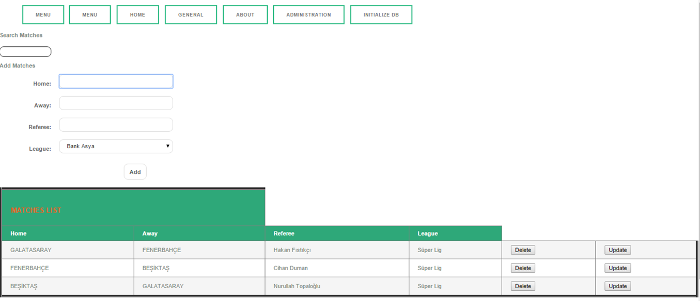
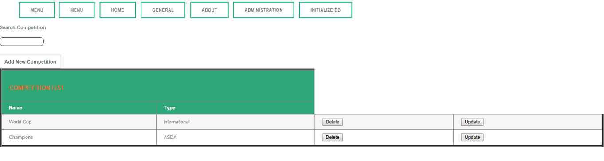

Parts Implemented by İhsan HALICI
=================================

Teams
~~~~~
Here waterpolo supporters can see the Teams List. They can examine the all datas of the teams. They can search teams.
They can also add team, delete team and update a team. But we can come back to the initial values with INITIALIZE DB.

 .. figure:: teams.png
      :width: 100 %
      :align: center
      :height: 250px
      :alt: teams list

      List teams table

Matches
~~~~~~~

Here waterpolo funs can follow the all matches in the waterpolo leagues. They can do all operations(add,delete,update,search).
But we can come back to the initial values with INITIALIZE DB.

      List matches table

Competition
~~~~~~~~~~~

Here users can see the all competitions in the waterpolo environment. So, they learn the different types of tournament.
They can do all operations(add,delete,update,search). But we can come back to the initial values with INITIALIZE DB.

      List competition table

